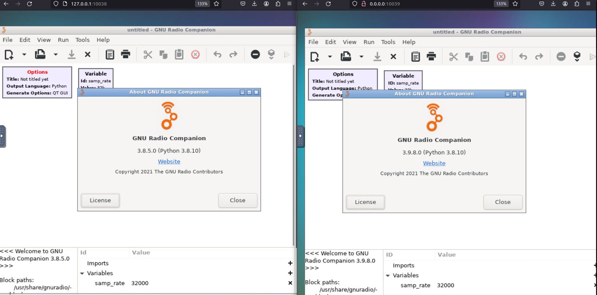

## GNURadio NoVNC Docker Environments for Multiple Versions
These Docker images provide a fully functioning NoVNC GUI environment for running different versions of GNURadio
Currently I have builds for GNURadio 3.8, 3.9 and 3.10. My hope is to offer a multi-version development solution for porting and cases that require concurrent versions of GNURadio.

### PyBombs Replacement?
As a long-time user of PyBombs, I understand the Pros/Cons of it. The GNURadio core framework has improved immensily since the days of 3.7/3.8, so I have found that keeping active versions of older GNURadio builds serves me less and less. However, there are occasions where I'd like to investigate a block that is only available for an older verison of GNURadio (for example GNURadio 3.8), which is where I use these containers. After I see they can work, I have the choice to either port the block, or create a slimmer container for the blocks from an older version and use ZMQ sockets for the inbound/outbound streams (more on that in another project).
You can build yourself from these files or pull from my  [Dockerhub](https://hub.docker.com/u/muaddib1984)

##### The Below image shows 2 NoVNC Browser Displays running Ubuntu Desktop with different versions of GNURadio (3.8.5 on left/3.9.8 on right)


## Building
```docker build -t gr38 -f Dockerfile.gr38 .```

```docker build -t gr39 -f Dockerfile.gr39 .```

```docker build -t gr310 -f Dockerfile.gr310 .```

#### (or just pull the images)

**GNURadio 3.8**

```docker pull muaddib1984/gr38_novnc```

**GNURadio 3.9**

```docker pull muaddib1984/gr39_novnc```

**GNURadio 3.10**

```docker pull muaddib1984/gr310_novnc```

## Usage
To Run:

```docker run --rm -dt --name gr38 -p 10038:80```

```docker run --rm -dt --name gr39 -p 10039:80```

```docker run --rm -dt --name gr310 -p 10310:80```

To Use GNURadio 3.8:

Navigate to ```127.0.0.1:10038``` in your web browser

To Use GNURadio 3.9

Navigate to ```127.0.0.1:10039``` in your web browser

To Use GNURadio 3.10

Navigate to ```127.0.0.1:10310``` in your web browser

To Stop:

```docker stop gr38```

```docker stop gr39```

```docker stop gr310```

#### CREDITS
All credit really goes to [@tdsepsilon](https://twitter.com/tdsepsilon) for his post [here](https://teaandtechtime.com/simple-gnuradio-server-setup-with-novnc-docker/)
I just changed the dependencies and repos to match various versions.
